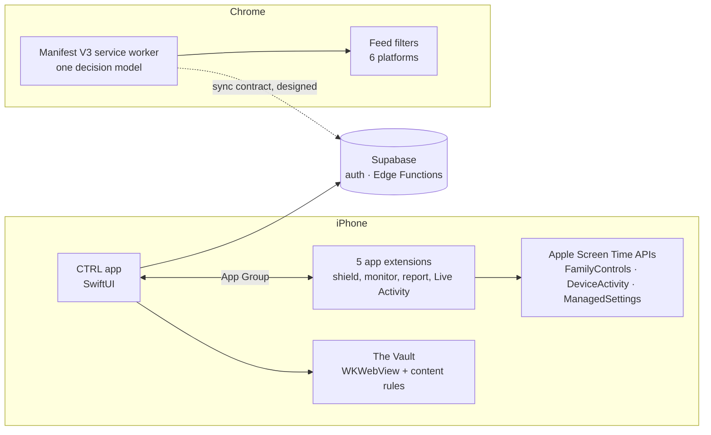

# CTRL — Take Back Your Time

A digital-wellbeing app that blocks distractions at the system level and turns social feeds into something you use on purpose.

🏆 2nd of 150+ teams — [Ansary Entrepreneurship Competition](https://www.stevens.edu/news/innovation-expo-2026-one-day-four-years-in-the-making), Stevens Institute of Technology ($5,000 prize) 
📱 [Available on the App Store](https://apps.apple.com/ng/app/ctrl-take-back-your-time/id6758465165) 
🌐 Companion Chrome extension (in development, not yet on the Chrome Web Store)

  
  
  

> Public showcase. The source code lives in a private team repository.

---

## The Product

Phones are built to be picked up, and the feeds on them are built to keep you scrolling. Most screen-time apps respond by nagging: warnings, streaks and guilt. People switch them off.

CTRL takes the opposite approach. It enforces the limits you choose at the operating-system level, keeps the useful parts of social apps while stripping out the endless parts, and makes every exit a single tap. The goal is control, not shame.

It is for people who want their attention back without deleting every app: students, people working from home, anyone who opens Instagram "for a second" and loses twenty minutes.

- **Real blocking.** Schedule app limits, keep some apps always blocked, or start a protected focus session that shields chosen apps until it ends.
- **Ultimate Lockdown.** A set of apps that only open in short access windows, with a limited number of passes.
- **The Vault.** A built-in browser for Instagram, YouTube, TikTok, X, Facebook and LinkedIn that hides Shorts, Reels and suggested posts and runs on a daily minute budget.
- **Quick Reset.** Short breathing and grounding exercises for the moment before you reach for a feed.
- **Brain Health.** A daily score that rises with focus and restorative time and falls with screen-time spikes, plus a history of what was actually measured.
- **Chrome extension.** The same blocking, time budgets and feed filters on the desktop browser.

---

## Engineering CTRL

CTRL is more than a SwiftUI app. It spans iOS system extensions, Apple's Screen Time APIs, an embedded and instrumented browser, backend services, and a separate Chrome extension.

| Piece | Role |
|---|---|
| iOS app | Sessions, schedules, scoring, history, The Vault |
| App extensions (5) | Shield screens and actions, schedule callbacks, screen-time reports, Live Activity |
| Backend | Sign in with Apple and App Store-compliant account deletion |
| Chrome extension | Site blocking, budgets, focus sessions, Lockdown and feed filters on desktop |

---

## Engineering Highlights

### System-level blocking on iOS

**Problem.** iOS does not let an ordinary app block other apps. Only Apple's Screen Time frameworks can, and they run much of their logic outside the app, in separate extension processes with tight limits.

**Design.** Blocking is built on FamilyControls (permission and app selection), ManagedSettings (applying shields) and DeviceActivity (schedule and limit callbacks), spread across 5 app extensions: shield action, shield configuration, activity monitor, screen-time report and a Live Activity. The extensions and the app share state through one App Group, with every cross-target identifier defined in a single place.

**Why it mattered.** None of this works without Apple's Family Controls entitlement, which had to be secured for all 5 targets through App Store review, with privacy manifests and a 7-batch Human Interface Guidelines audit. Keeping shared state in one authority is what stops the app and its extensions from disagreeing about what is blocked.

### Controlling web feeds

**Problem.** People do not want to lose Instagram or YouTube entirely, just the parts designed to keep them scrolling.

**Design.** The Vault is a time-budgeted browser built on WKWebView. Compiled content rules (WKContentRuleList) block what can be blocked before a page loads, and injected JavaScript hides feed sections and stops autoplay for what cannot. Each of the 6 platforms is described in a declarative platform registry, with a hard daily cap that bills real elapsed time.

**Why it mattered.** Social sites change their markup constantly. Keeping per-platform behavior in data rather than scattered code means a broken filter is a registry change, not a rewrite.

### Browser enforcement

**Problem.** On the desktop, blocking, schedules, budgets, focus sessions and Lockdown can all apply to the same site at the same moment, and they must never contradict each other.

**Design.** The Chrome extension is a Manifest V3 service worker that enforces through dynamic `declarativeNetRequest` rules, with content filters for the same 6 platforms. Every feature resolves through one decision model with documented precedence rules (Lockdown outranks everything; a break can open a site you blocked yourself, but not blocked hours or a focus session). The principle: the domain decides what should happen; the Chrome adapter decides how Chrome enforces it.

**Why it mattered.** One decision model makes the behavior explainable and testable, and it is the same shape a shared iOS and desktop policy needs, which is why a provider-neutral sync contract with the iOS app is already designed.

### Reliability and honest state

**Problem.** A blocker that silently stops blocking is worse than none, because users trust it.

**Design.** When iOS is not enforcing a rule, the app says so instead of showing a green light, and History separates measured data from missing data. The extension's stored state has 8 versioned migrations so updates never lose a user's settings.

**Why it mattered.** Trust is the product. Every state the user sees has to be true.

---

## Architecture / Tech Stack

| Area | Technology |
|---|---|
| iOS app | Swift, SwiftUI, WidgetKit (Live Activity) |
| iOS system integration | FamilyControls, ManagedSettings, DeviceActivity, App Groups |
| Embedded browser | WebKit (WKWebView, WKContentRuleList), injected JavaScript |
| Backend | Supabase, Deno Edge Functions, Sign in with Apple |
| Chrome extension | TypeScript, React, WXT, Manifest V3, `declarativeNetRequest` |
| Testing | Swift Testing, XCTest, Vitest, Playwright |
| CI | GitHub Actions |

---

## Building It

- **Test-driven development** on both clients: Swift Testing and XCTest on iOS, Vitest unit tests and Playwright end-to-end tests on the extension.
- **GitHub Actions** gates every extension change on the full test suite.
- **Agentic software development.** Multiple AI coding agents work in parallel under a shared code-review standard, with parallel automated review and tasks routed to different model tiers to control cost.
- **Human ownership.** Architecture, validation and final review stay with the engineer. The agents write code; they do not make the decisions.

---

## My Contribution

CTRL is a team project: four Stevens students built and pitched it together, and the competition result belongs to the team.

**iOS Engineer — 2025–present**

- Wrote ~60K lines of production Swift across the app and its 5 extensions, with 890+ commits and 219 merged pull requests.
- Built the Chrome extension on my own (~26K lines of TypeScript and React).
- Took the app from TestFlight beta to the App Store, including the Family Controls entitlement and App Store review.
- Designed the agentic development workflow and the shared code-review standard the project uses.

---

## Results

- Released on the App Store
- A dozen TestFlight users in the first month, 20+ testers since
- 2nd of 150+ teams, Ansary Entrepreneurship Competition
- $5,000 competition prize

---

## What's Next

- Continuous integration for the iOS app on GitHub Actions
- PostHog analytics across the activation funnel (onboarding → permissions → first block → protection activated)
- Cross-device policy sync between iOS and Chrome

---

## Links

[App Store](https://apps.apple.com/ng/app/ctrl-take-back-your-time/id6758465165) · [LinkedIn](https://linkedin.com/in/mohamedbengabsia) · [GitHub](https://github.com/m0hamedb3ngab5ia) · [Competition article](https://www.stevens.edu/news/innovation-expo-2026-one-day-four-years-in-the-making)
