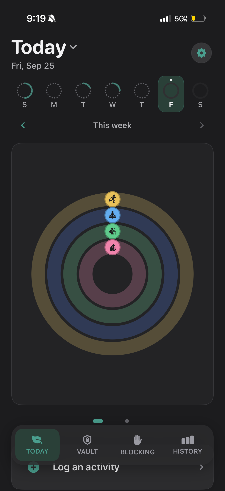
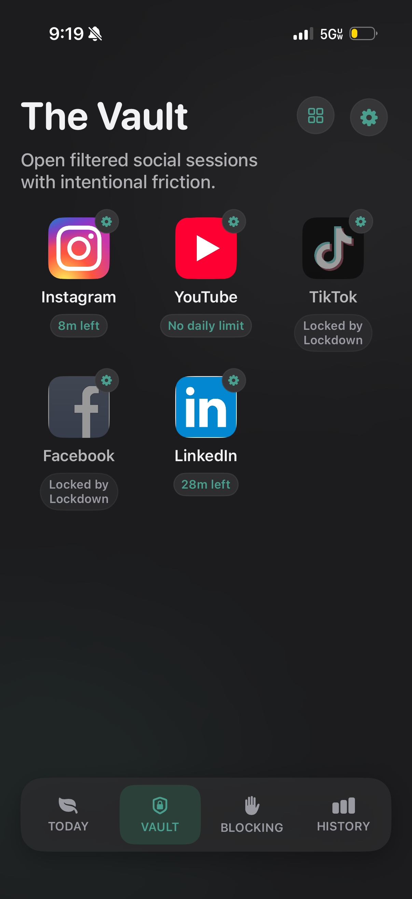
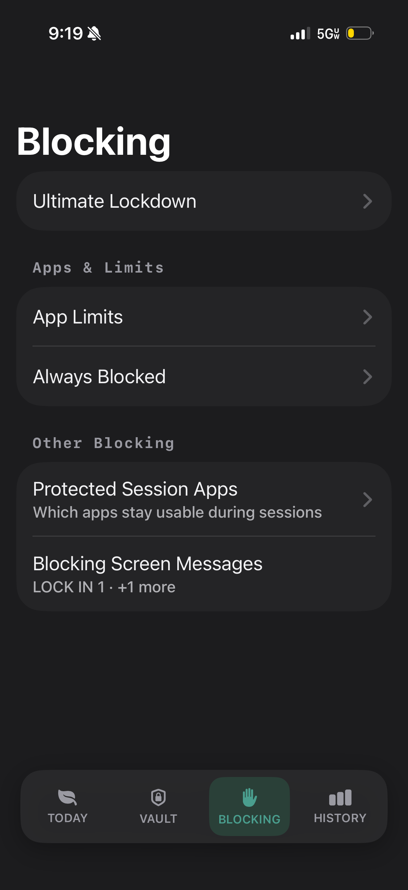
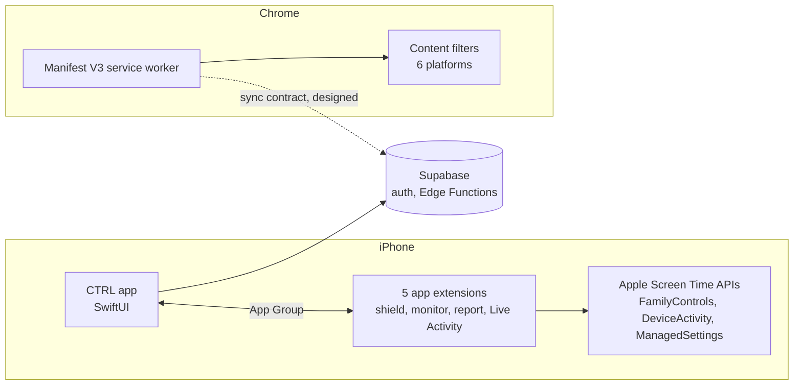

# CTRL: Take Back Your Time

**A digital-wellbeing app for iPhone, with a companion Chrome extension, that helps people spend their attention on purpose.**

> This is a public showcase. The source code lives in a private repository. This page covers what CTRL is,
> how it is built, and my part in it.

🏆 **2nd place of 150+ teams** in Stevens Institute of Technology's university-wide Ansary Entrepreneurship Competition ($5,000 prize).

  
  
  

---

## What it does (non-technical overview)

Most screen-time apps nag. CTRL gives you control instead:

- **Blocking that actually blocks.** Schedule limits for distracting apps, or start a protected focus session and CTRL shields them until it ends. Every exit is one tap: no guilt trips or streak shaming.
- **Feeds without the rabbit hole.** A built-in browser for Instagram, YouTube, TikTok, X, Facebook and LinkedIn hides Shorts, Reels and recommended posts, and gives each day a minute budget.
- **Quick resets.** Short breathing and grounding exercises for the moment before you reach for a feed.
- **A score you can see move.** A daily Brain Health score rises with focus time and falls with screen-time spikes.
- **Your desktop too.** The Chrome extension brings the same blocking, time budgets and feed filters to the browser.

## Technical overview

| Piece | Built with | What it does |
|---|---|---|
| iOS app | Swift, SwiftUI | Focus sessions, schedules, scoring, history |
| App blocking | FamilyControls, ManagedSettings, DeviceActivity | Scheduled and session-based blocking across 5 app extensions sharing state through an App Group |
| In-app browser | WKWebView, WKContentRuleList, injected JavaScript | Controls feed visibility and autoplay on 6 platforms from one declarative platform registry, with hard daily caps |
| Backend | Supabase, Deno Edge Function | Sign in with Apple and App Store-compliant account deletion |
| Chrome extension | TypeScript, React, Manifest V3, WXT | Blocking, time budgets, focus sessions and Lockdown mode through dynamic `declarativeNetRequest` rules |
| Testing | Swift Testing, XCTest, Vitest, Playwright | Test-driven development on both clients; end-to-end tests gated by GitHub Actions CI on the extension |

### Technical details worth calling out

- **Apple entitlement and review.** Secured Apple's Family Controls entitlement across 5 targets through App Store review, with privacy manifests and a 7-batch Human Interface Guidelines audit.
- **One decision model on desktop.** The extension's schedules, budgets, focus sessions and Lockdown mode resolve through one model with documented precedence rules and 8 versioned storage migrations.
- **Honest status.** When iOS is not enforcing a rule, the app says so instead of showing a green light.
- **In progress:** continuous integration for the iOS app on GitHub Actions, and PostHog product analytics across the activation funnel (onboarding → permissions → first block → protection activated).

## My role

** iOS Engineer** on a student team (2025 – present).

- Contributor to the iOS codebase: ~60K lines of production Swift, written with test-driven development.
- Built the Chrome extension (~26K lines of TypeScript and React).
- Took the app from TestFlight beta (a dozen users in the first month, 20+ testers) to the App Store.
- Ran an AI-assisted workflow with multiple coding agents, a shared code-review standard and parallel automated review, while owning architecture, testing and final review myself.

## Links

- App Store: https://apps.apple.com/ng/app/ctrl-take-back-your-time/id6758465165
- Me: [LinkedIn](https://linkedin.com/in/mohamedbengabsia) · [GitHub](https://github.com/m0hamedb3ngab5ia)
